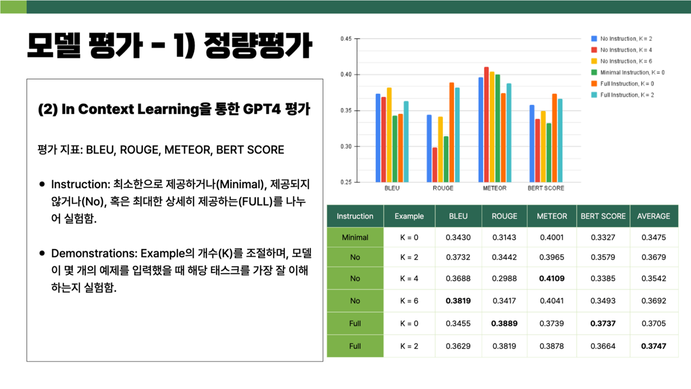

# Co_Deep_Learning

 

### 대회 🔥
----

 

- [박성완](https://github.com/Tro-fish), [홍동희](https://github.com/sth49)와 함께 하였습니다.
- 교내에서 진행하는 Co Deep Learning Project 에 참가하여 최우수상을 수상하였습니다.
- [뤼튼](https://wrtn.ai/store/details/65a635ea378fffc6a783914e)에서 저희 프롬프트를 만나보실 수 있습니다.

 

 

- 판교청소년수련관에서 진행하는 [COC(Circle Of Change) 휠체어 스포크 가드 제작](https://www.youtube.com/watch?v=JB-r7GDWkvc)이 도움이 될 수 있도록 해당 프롬프트를 강연한 바 있습니다.

 

- 최종적으로 In Cotext Learning 활용하여 영어나 디자인을 잘 모르는 사람들도 쉽게 활용할 수 있도록 기여하였습니다.

 

----

 

### 설명 📝

 

- [발표자료](/presentation/CODE_%EB%B0%9C%ED%91%9C%EC%9E%90%EB%A3%8C.pptx)에 저희의 흐름이 자세히 담겨 있습니다.

- 스포크 가드란, 휠체어 바퀴로 인해 신체 부상을 방지하고 나온 장치입니다. 이 장치는 옷과 동일하게 신체 보호의 목적을 넘어 개성 표현의 수단이 되었습니다. 하지만 직접 디자인하기엔 어렵고, 수요가 적어 비용이 비싸다는 단점이 있습니다.

- 하지만 AI 생성 시대에 힘 입어 누구나 자신만의 디자인을 할 수 있습니다.

- 아래는 저희가 [미드저니](https://www.midjourney.com)를 활용하여 제작한 예시들입니다.

 

 

